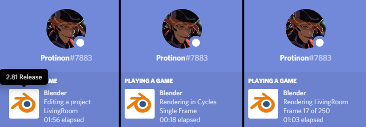

# Blender Rich Presence

If you want to show off what you're doing in Blender, then this is the addon for you! With added options, you can customize it you suit your preference. This is currently only supported on Blender 2.8 and above.

## Features

* **Multi-instance support:** Multiple Blender windows can be opened, and the one that was saved most recently will send data to Discord.
* **Rendering mode:** As shown in the image, it will show different data when rendering. It will have alternate text if rendering a single frame.
* **Blender Version:** A small feature, it shows the current Blender version in a nice format. For example: "2.81a Alpha"
* **Options:** Allows a few settings to be changed on the Blender addon screen, more info below.

## Options

* Show elapsed time
* Show elapsed time while rendering
* What to show while rendering: Filename or Render engine

## How to Install

Go to the "Releases" tab on this page, download the latest .zip, then install the .zip as a Blender addon. Again, this is only supported on Blender 2.8.